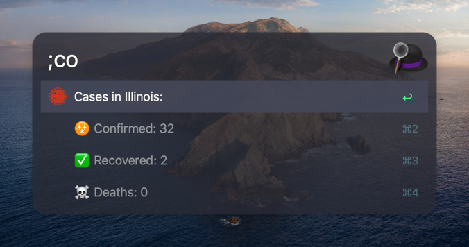
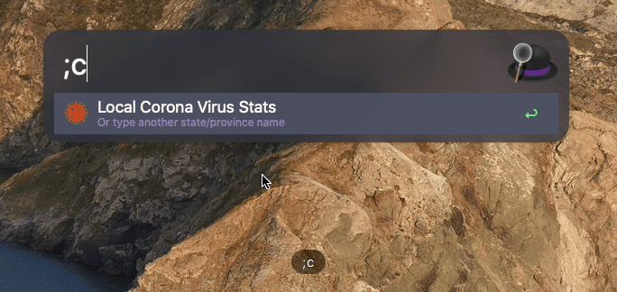
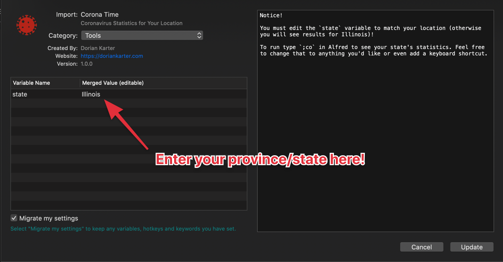

## Corona Time: An Alfred Workflow For Tracking COVID-19

See case statistics for your state: ☣️  Confirmed, ✅ Recovered, and ☠️  Deaths.

Data is provided by ArcGIS Esri Corona Virus Dataset.

## Screenshot

## DEMO

## Installation

1. Download and open the [workflow file](https://github.com/dkarter/CoronaTime/raw/master/CoronaTime.alfredworkflow)
2. Enter your State/Province:

## Collaboration
Please submit a PR with changes only to the `src/script_filter.rb` file. I will
test it and cut a new workflow release.

## License

MIT

Dataset is provided by [ArcGIS Esri Corona Virus dataset](https://coronavirus-resources.esri.com/datasets/bbb2e4f589ba40d692fab712ae37b9ac_1) and subject to ArcGIS Esri terms of licensing.
